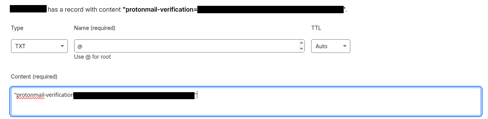
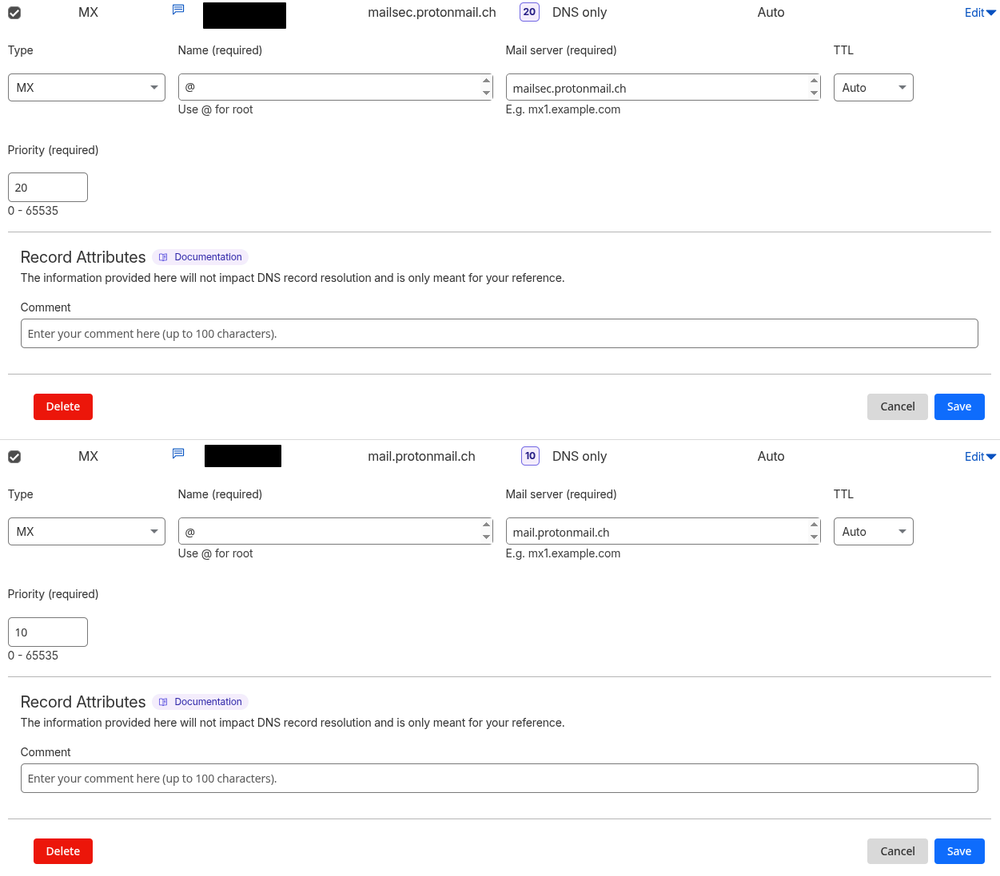
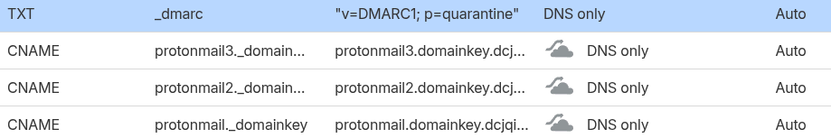
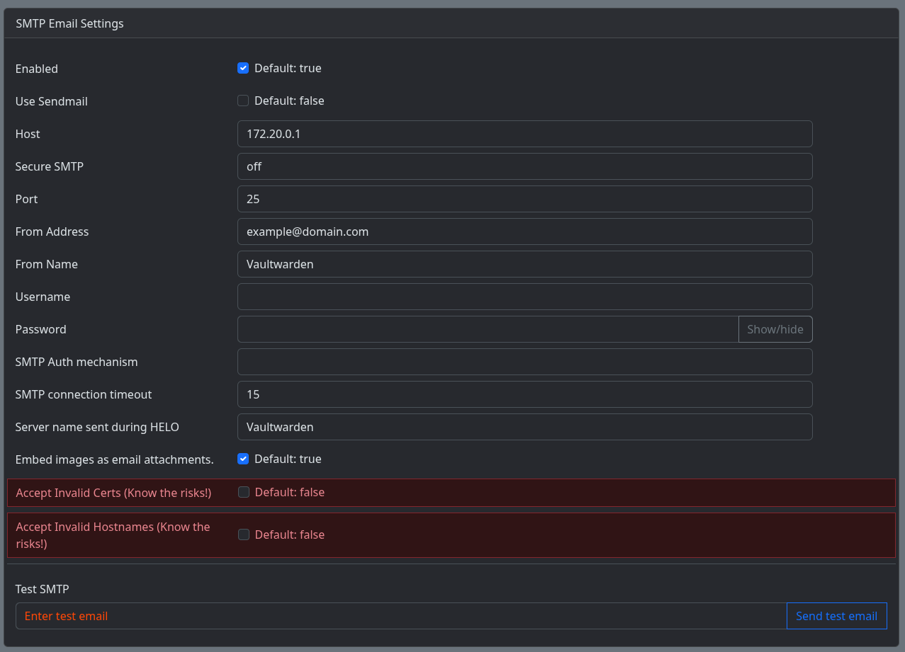

This guide walks you through deploying Vaultwarden, and setting up either Protonmail or Gmail as your SMTP provider. For protonmail, you need a proton mail paid account and a custom domain. We will be using the same network that we created in our Cloudflared+NPM+TinyAuth guide.


# Vaultwarden Setup
---

We will be picking up from our previous guide and include Vaultwarden as a service. We will take the `compose.yml` from the official [Vaultwarden GitHub](https://github.com/dani-garcia/vaultwarden) with our own touches

```yaml
services:
  vaultwarden:
    image: vaultwarden/server:latest
    container_name: vaultwarden
    restart: unless-stopped
    environment:
      ADMIN_TOKEN: ${ADMIN_TOKEN}
      DOMAIN: "https://vw.domain.com"
    volumes:
      - ./vw-data/:/data/
    ports:
      - 8000:80
    networks:
      - tunnel-net
      
networks:
  tunnel-net:
    name: tunnel-net
    external: true
```
And we will also create a `.env` file with the admin token. This can be generated by performing the following command on a running bitwarden container:

`docker exec -it vwcontainer /vaultwarden hash`

Or you can create a temporary container by inputting the following CLI command. Ensure that you run `docker compose down --remove-orphans` to kill the temporary container.

`docker run --rm -it vaultwarden/server /vaultwarden hash`

We will then take this password and put it in our `.env` file. This is a generated password of "password"

```.env
ADMIN_TOKEN='$argon2id$v=19$m=65540,t=3,p=4$YHwTNF0/SHe/k59bODwuFb/bvSgboFgMimgBb3qQozY$Yjs52CdQSePecKuV7sbdLttZeNcpt3YUed1FVMxTqlc'
```

Okay great, Vaultwarden container set up. Let's test this at the admin domain by going to `https://vw.domain.com/admin`. If you want to keep the admin page open permanently, I recommend protecting it with Tinyauth. We can set the following in the `NPM NGINX Custom Configuration` window:

```
# Root location
location /admin { # protect just the /admin subdomain
  # Pass the request to the app
  proxy_pass          $forward_scheme://$server:$port;

  # Add other app-specific config here

  # Tinyauth auth request
  auth_request /tinyauth;
  error_page 401 = @tinyauth_login;
}

# Tinyauth auth request
location /tinyauth {
  # Pass request to Tinyauth
  proxy_pass http://172.20.0.1:3000/api/auth/nginx; # If you used the previous tunnel-net, you don't need to change this

  # Pass the request headers
  proxy_set_header x-forwarded-proto $scheme;
  proxy_set_header x-forwarded-host $http_host;
  proxy_set_header x-forwarded-uri $request_uri;
}

# Tinyauth login redirect
location @tinyauth_login {
  return 302 https://tinyauth.example.com/login?redirect_uri=$scheme://$http_host$request_uri; # Replace with your app URL
}
```
## Gmail SMTP Compose File
---

I personally run the [postfixrelay](https://github.com/loganmarchione/docker-postfixrelay) container. I have several services that use SMTP and this simplifies pointing since I only need to put the SMTP Password in one location. Be warned though this ***will not*** work for containers that require authentication. For those, you can still run normal SMTP services, just not through this container.

Lets take the example `compose.yml` from the Github, and make some modifications.

```yaml
services:
  postfixrelay:
    container_name: postfixrelay
    restart: unless-stopped
    environment:
      - TZ=America/New_York
      - RELAY_HOST=smtp.gmail.com
      - RELAY_PORT=465 # I have not been successful in making 587 work
      - RELAY_USER=your_email_here@gmail.com
      - RELAY_PASS=${relay_pass}
      - RELAY_SUBMISSIONS=true
      - TEST_EMAIL=test_email@domain.com # Delete after successful configuration
      - TEST_EMAIL_SUBJECT=Destroy After Reading # Delete after successful configuration
      - MYORIGIN=domain.com
      - FROMADDRESS=my_email@domain.com
      - MYNETWORKS=172.20.0.0/16
      - MSG_SIZE=30720000
      - LOG_DISABLE=false
    networks:
      - tunnel-net
    ports:
      - 25:25
    volumes:
      - ./postfixrelay/data:/var/spool/postfix # I prefer bind mounting volumes for portability
    image: loganmarchione/docker-postfixrelay:latest

networks:
  tunnel-net:
    name: tunnel-net
    external: true
```

### Gmail SMTP Password
---

In order for us to set up Gmail SMTP, we need to get an app password. We are only able to do this if we have 2 Factor Authentication enabled on our account. If you don't have it enabled, go to [this link](https://myaccount.google.com/signinoptions/two-step-verification) and follow the steps to enable it.

Now we need to get an [app password.](https://myaccount.google.com/apppasswords) The name is not important, just make sure it's distinguishable. Once you hit create, make sure you copy the app password. You will **NOT** see it later.

Now we can ammend the app password into the `.env` file like so:

```env
relay_pass=aaaa bbbb cccc dddd
```

Once you have done so, you can bring the compose file up with `docker compose up` (not detatched) and monitor the logs for any issues. You should start receiving SMTP emails from your gmail account.


## Proton SMTP Compose File

This is very similar to Gmail, except we will follow [these instructions.](https://proton.me/support/smtp-submission) There is a lot going on, so let's break it down.

Here is our basic `compose.yml` file.

```yaml
services:
  postfixrelay:
    container_name: postfixrelay
    restart: unless-stopped
    environment:
      - TZ=America/New_York
      - RELAY_HOST=smtp.protonmail.ch
      - RELAY_PORT=465 # I have not been successful in making 587 work
      - RELAY_USER=your_email_here@domain.com
      - RELAY_PASS=${relay_pass}
      - RELAY_SUBMISSIONS=true
      - TEST_EMAIL=test_email@domain.com # Delete after successful configuration
      - TEST_EMAIL_SUBJECT=Destroy After Reading # Delete after successful configuration
      - MYORIGIN=domain.com
      - FROMADDRESS=my_email@domain.com
      - MYNETWORKS=172.20.0.0/16
      - MSG_SIZE=30720000
      - LOG_DISABLE=false
    networks:
      - tunnel-net
    ports:
      - 25:25
    volumes:
      - ./postfixrelay/data:/var/spool/postfix # I prefer bind mounting volumes for portability
    image: loganmarchione/docker-postfixrelay:latest

networks:
  tunnel-net:
    name: tunnel-net
    external: true
```

### Protonmail SMTP Configuration

Let's make sure we have SMTP set up correctly per [these instructions.](https://proton.me/support/smtp-submission#:~:text=on%20your%20computer.-,How%20to%20set%20up%20SMTP,-In%20your%20browser)

Wait wait wait, we need to set up a custom domain? Easy enough, although it may take time. Not because it's difficult, but because DNS records will take a while to update. First things, follow [these instructions](https://proton.me/support/custom-domain#:~:text=up%20your%20organization.-,Step%202%3A%20Connect%20and%20verify%20your%20domain,-Note%3A%C2%A0If) to verify your custom domain with protonmail.

Your `Cloudflare DNS Record` should look like the following



[Create a User](https://proton.me/support/custom-domain#:~:text=domain%20verification%20tab.-,Step%203%3A%20Create%20new%20users%20and%20addresses%20for%20your%20custom%20domain,-Before%20continuing%2C%20make)

Now let's update our DNS records. Follow [these instructions.](https://proton.me/support/custom-domain#:~:text=to%20your%20organization.-,Step%204%3A%20Update%20MX%20records,-Before%20continuing%2C%20make) Your `Cloudflare DNS Record` should look like this.



Finally, let's add the rest of the [fun stuff.](https://proton.me/support/custom-domain#:~:text=lowest%20priority%20number.-,Step%205%3A%20Configure%20SPF%2C%20DKIM%2C%20and%20DMARC%20records,-SPF%2C%20DKIM%2C%20and) As always, it should look like:



Woof, okay, we're done. Make sure your emails can hit other email providers such as google before we move on.

# Vaultwarden SMTP Configuration
---

Okay, now let's link vaultwarden to our new SMTP provider. Our SMTP should be configured as follows:



Send a test message and verify that everything works! You can use the same configuration for any other SMTP profile. For some, you may have to configure the Host IP as 172.20.0.1:25 if there is no port option.
